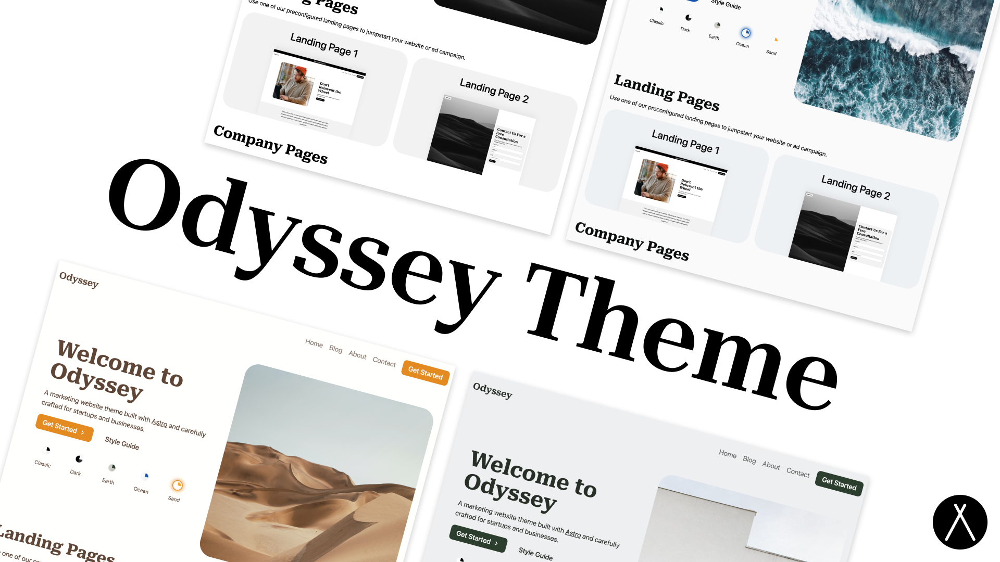

<p align="center">
  
</p>

<br/>
<div align="center">
  <a href="https://twitter.com/jaydanurwin">
  
</a>
  <a href="https://sapling.lemonsqueezy.com/checkout/buy/9b78751f-6382-442d-ac99-32c2318b70a0">
    
  </a>
</div>
<br/>

# Odyssey Theme

Odyssey Theme is a modern theme/starter for a business or startup's marketing website. It provides landing page examples, a full-featured blog, contact forms, and more. It is fully themeable to match your business' branding and style. It even includes a theme switcher component to show how easily the entire style of the site can be changed with only a few lines of CSS.

## Features

<p align="center">
  
</p>


- ✅ **A perfect score in Lighthouse**
- ✅ **Blazing fast performance thanks to Astro 🚀**
- ✅ **A Full Featured Blog with Tagging**
- ✅ **Fully theme-able styles with for buttons, shapes, backgrounds, surfaces, etc.**
- ✅ **Responsive, mobile-friendly landing pages**
- ✅ **SEO Best Practices (Open Graph, Canonical URLs, sitemap)**
- ✅ **Performant Local Fonts Setup**
- ✅ **Contact Forms Setup for Netlify, Formspree, Formspark, etc.**
- ✅ **A package of ready-to-use UI components**


## Demo

View a [live demo](https://odyssey-theme.sapling.supply/) of the Odyssey Theme.

## Documentation

1. View the [Theme Setup Guide](https://odyssey-theme.sapling.supply/theme/theme-setup)
2. View the [Customizing the Theme Guide](https://odyssey-theme.sapling.supply/theme/customizing-odyssey)

## Updating the homepage hero image

The hero portrait on the landing page is rendered by [`src/components/sections/heros/HomeHeroSection.astro`](src/components/sections/heros/HomeHeroSection.astro). Update the `src` attribute of the `` inside the `<picture>` element to point at your new image asset (for example, replace `/assets/images/home/classic-hero.jpg` with your own file path). Make sure the file is available under `public/` or `assets/` so Astro can serve it during the build.

## Usage

```bash
cd theme

npm install

npm start
```

## Deploy

Feel free to deploy and host your site on your favorite static hosting service such as Netlify, Firebase Hosting, Vercel, GitHub Pages, etc.

Astro has [an in-depth guide](https://docs.astro.build/en/guides/deploy/) on how to deploy an Astro project to each service.

## Support

Please feel free to post issues or submit PRs to this repo and we will do our best to respond in a timely manner, keeping in mind this template is offered for free as is on GitHub. 
